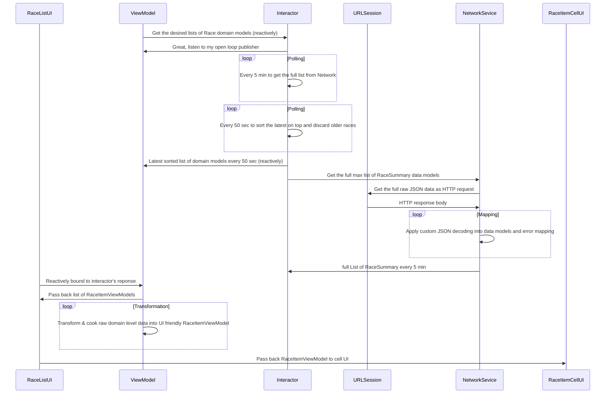

# MyCountry
An app made with ❤️ to demonstrate some examples of **clean architecture**, **code organisation**, **loose coupling**, **unit testing** and some of the best practices used in modern iOS programming using `Swift`.

App Goal:
- Load a list of facts (could be anyhting, E.g. for a Country like Canada)
- Show those facts in table view
- Download images of those facts asynchronously as if needed to be displayed (prefetching as desired)
- Add suport for iPhone and iPad in all orientation and size classes to adapt the UI nicley
- Apply some custom styling and theming
- Add support for iOS 13 **Dark mode** (if iOS 13 only, uses default light mode for iOS 11 and 12)

A simple list of facts are saved in a dropbox location that serves as a GET api call for JSON api response. 
`https://dl.dropboxusercontent.com/s/2iodh4vg0eortkl/facts.json`

## Installation

- **Xcode 11.4**(required) with Swift 5.0
- For **convenience**  `Carthage/Checkouts` and `Carthage/Build` folders are checked in the repo. So if you are downloading/cloning this project, those are `ready` and `Xcode 11.4` should compile as long as `Swift 5.0` is available.
 - **Optional step**: Run the Carthage (version 0.32 or later) update command to `fresh install` the dependent libraries in the `Cartfile`
    > **`carthage update --platform iOS`** 
- Clean and build the project in Xcode or `/DerivedData` folder if needed

## 3rd Party Libraries Used
 - **`RxSwift`** - to make `Reactive` binding of API calls and responses 😇
 - **`SnapKit`** - to snap auto layout constraints with ease 🤓 
 - **`SkeletonView`** - to show loading shimmers... 🙈 
 - **`Quick`** - to unit test as much as possible 👨🏽‍🔬🧪
 - **`Nimble`** - to pair with Quick for easy syntaxing 👬

## Clean Architecture
 - **VIPER** & **MVP** - A hybrid achitecture
 - Clean communication between **`Display`**, **`Presenter`** in the view/scene stack
 - Communication between  **`Interactor`**, **`Service`** in the lower stacks of domain & network layers
 - Connectivity of this components are achieved via protocol instances to achieve loose coupling and unit testability
 - `View` (i.e. View Controller) is `Display` itself and contacts its `Presenter`
 - `Presenter` may perform view related logic and immediately talk back to `Display` (e.g. list data source handling, image lading operation queues)
 - `Presenter` can communicate with underlying `Interactor` layer for more complex task
 - `Interactor` decides all Domain level business logic to take care of
 - `Interactor` communicates with underlying `Service` layer
 - `Service` communicates to its underlying **`HttpClient`** which handles all networking
 - `Interactor` gets back information via `Rx` binding from `Service`
 - `Interactor` parses the data and apply any necessary data transformation (eg. empty list of facts or subject name missing etc.)
 - `Interactor` gives outcome back to `Presenter` via callbacks
 - `Presenter` handles all the presentation reated logic nesessary for the view
 - `Presenter` uses a helper  **`Transformer`** that only cares about domain data to presentation item transformation needed for table cell UI binding
 - `Presenter` talks back to `Display` and commands UI update tasks
 - `Presenter` talks back to `Router` (if available and needed) for navigation tasks
 
 ## Code Organisation / Layers / Grouping
 
 > Folder / Grouping are done as per below:
 
 Project has 3 targets:
  - **MyCountry** - The main code
  - **MyCountryTests** - **Unit testing** of all the code layers using Quick/Nimble
  - **MyCountryUITests** - No tests implemented yet. Can be done via Mocking API response via library like `Embassy`
  
 
 
 > The codebase is grouped into 3 layers - `PresentationLayer`, `DomainLayer`, & `NetworkLayer`
 
 
 #### Presentation Layer
 
  > It has all the presnetation logic
  
 
 
 - Has helpers such as Theme, Localization, Accessbility etc.
 - Has one main scene:
 - `FactsList`: The list of facts in table view
 
 > Breakdown of each `Scene` stack:
  - `ViewController`
  - `Presenter`
  - `Display`
  - `Router` (optional if needed)
  Presenter & Display communication logics are unit tested.
  If there exists a `Router`, that can be unit tested too.  In this app, it's single view app, hence no `Router` is used.
  
 #### Domain Layer
 
  > It has all domain level logic via the Interactor
  
 - `FactsInteractor` which loads the facts
 - Data model used - `FactsList -> (subjectName, [Fact])`
 - The logic is unit tested
 
  #### Network Layer
  
 
 
  > It has all data/network layer logic

 - `BaseRequest` ->  `FactsFindingRequest` & `ImageLoadingRequest`
 -  `FactsFindingService` & `ImageLoadingService`
 - `HTTPClient` uses Apple's `URLSession`
 - `ObservableDataSource` is used to provide a layer of abstraction and to be able to unit test
 -  `Decodable` Data model used for `Fact` and `FactsList`
 - Above logics are unit tested
 
 #### Testing Layers
 
 

## App Demo

### *Smaller* iPhone Screens - (non plus size)
- Same layout in both potrait and landscape mode

### *Larger* iPhone Screens - (plus size)
- Compact (i.e. narrow) layout in *potrait* mode
- Regular (i.e. wide) layout in *landscape* mode

#### **Loading Shimmers**

#### **Light / Dark mode toggles**

## **iPad screens**
- Regular (i.e. wide) layout in *both* potrait and landscape mode

  

  

**Error Handling**
- `Network connection unavailable` error is shown separately
- Any other error leads into a `generic` error message

 
 

